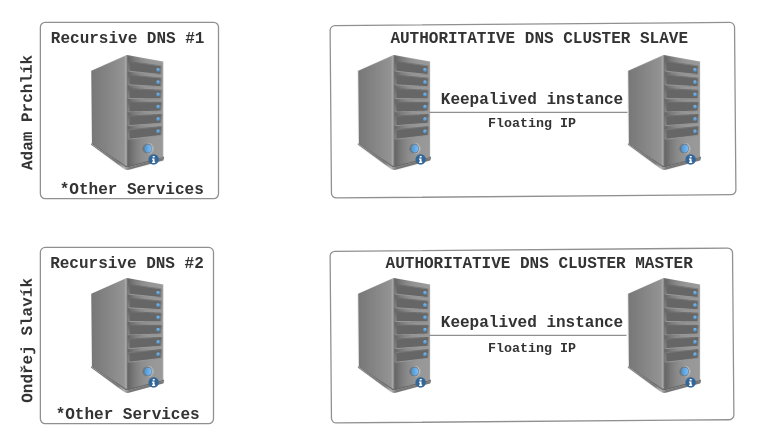

# TODO

- Musíme dodělat ten Slave DNS cluster a otestovat to, ale mělo by to běžet ok
  - Přidat do DNS záznamů adamovy stroje
  - Zkusit a spustit Adamův authoritative DNS Slave a zjistit, jestli si správně stáhne data
  - Vyzkoušet výpadek
- Mít na obou clusterovaných strojích shodné informace - Nemám!
- Rekurzivní DNS je momentálně neskutečně naprasenej, nešlo by to udělat líp? 
  - Všechny dotazy nyní prvotně směřuje na cluster, kterej ale zná jen \*.local
  - Když bude chvíli času, podívat se, jestli by to nešlo udělat nějak pomocí pohledů či co
- Spustit na neclusterových pc nějaké služby ať máme co dát do záznamů (https)

# DNS Cluster

## Goals of this project

The goal of this project is to create complete DNS infrastructure for mid to large size company with DNS clusters. These clusters will be used to provide Domain Name System (DNS) services for the domain ".local." including reverse queries.

## Authors

- Adam Prchlík
  - Email: [adam.prchlik@example.com](mailto:adam.prchlik@example.com)

- Ondřej Slavík
  - Email: [slavion7@fit.cvut.cz](mailto:slavion7@fit.cvut.cz)

## Diagram of the project

## Diagram explanation

This project simulates a prutian approach for DNS in a larger company. 
It divides DNS servers into recursive (for serving users) and authoritative (for serving the domain(s) - in this case "*.local."). 

The assumption is that ordinary users will use recursive DNS servers to resolve queries for them. In this case, other services are hosted on these servers due to lack of machines.
The authoritative servers are located in the fail-over cluster. They are a much more critical infrastructure as they serve the domain(s) (*.local.) and can also be used as Slave Authoritative DNS for other organizations. 

If a computer in the cluster fails, the other server (VRRP - keapalived) takes over its role.
In the event of a complete cluster failure, the second cluster will still serve the domain(s)

## Explanation of servicies programs? TODO

### DNS

Domain Name System is a decentralized system that translates human-readable domain names to IP adressess (example.com -> 2001:DB8::F1). DNS operates as a distributed system with a hierarchical structure starting with a root domain: "." 

### DNS Servers

#### DNS Recursive Servers

They are used to find IP addresses by searching for domain information on their behalf, navigating through DNS hierarchy until the information is found. They cache gained iformation which reduces traffic to DNS root servers. It is recommended that every mid to large LAN have at leaset two (Master & Backup)

#### DNS Authoritative Servers

Authoritative DNS servers store and provide DNS records for specific domain names, acting as the ultimate source of truth for domain-related information (IPv4/6 addresses, servers for e-mail, ...). It is neccessary that at least two servers serve a domain - Master & Slave. The only difference between Master & Slave servers is that Slave servers in periodic intervals checks Master for actual information about DNS zones, The answer from Master and Slave have the same trustworthness

#### BIND9

BIND, or BIND9, is an open-source software implementation of the Domain Name System (DNS) protocol. It can serve as Authoritative, Recursive or Mixed DNS server. It is the most widely used software for DNS and support all DNS features.

### VRRP

Virtual Router Redundancy Protocol is a network protocol used to provide high avalibility by allowing multiple network devices to share a virtual IP address. One device is elected as the virtual router master, while the others act as backups. If the master fails, one of the backup routers takes over as the master. OpenBSD alternative for VRRP is CARP (Common Address Redundany Protocol)

#### Keepalived 

Keepalived is an open-source implementation of VRRP for Linux-based systems. It supports many security features like sending emails in case of server failure and it runs as a deamon.

## Documentation setup

### Authoritative cluster

TODO - Vyřešit posílání záznamů mezi stroji v clusteru!

- Update system: sudo apt update && sudo apt upgrade (Debian-based)
- Install all necessary packages: arping, traceroute, net-tools, keepalived, bind9
- Set up keepalived (on all machines in cluster)
  - Edit conf file: sudo vim /etc/keepalived/keepalived.conf (Example of configuration in "keepalived.conf")
  - Start service: sudo systemctl start keepalived
  - Check logs: cat /var/log/syslog
  - Enable service: sudo systemctl enable keepalived
  - Test Virtual IP: ping <Virtual IP>
- Set up BIND9
  - Edit options file: sudo vim /etc/bind/named.conf.options (Example of configuration in AUT-named.conf.options")
  - Edit local (add local domains) file: sudo vim /etc/bind/named.conf.local (Example of configuration in ATU-named.conf.local")
  - Create domain entries -> zones/*
  - Check conf files: named-checkconf -z /etc/bind/named.conf
  - Start service: sudo systemctl start named
  - Check logs: cat /var/log/syslog
  - Enable service: sudo systemctl enable named
  - Check from other computer: host \<domain name\> \<virtual ip\>
- Test by shutting down machines

### Recursive server

TODO - Napraseno - opravit!

- Update system: sudo apt update && sudo apt upgrade (Debian-based)
- Install all necessary packages: arping, traceroute, net-tools, bind9
- Set up BIND9 as recursive
  - Edit conf file: sudo vim /etc/bind/named.conf (Example of configuratio in REC-named.conf)
  - Check conf-files: named-checkconf -z /etc/bind/named.conf
  - Start service: sudo systemctl start named
  - Check logs: cat /var/log/syslog
  - Enable service: sudo systemctl enable named
  - test from other machine: host \<domain name\> \<server ip\> 

## Possible improvements

- DNSSEC
  - Hide Master DNS and sign DNS on the fly with other server
- Set up database cluster for storing data
- Dynamic DNS
- Enum
- Set one cluster on different service (if critical vulnarability occurs)
- Send logs to other (independed) server
